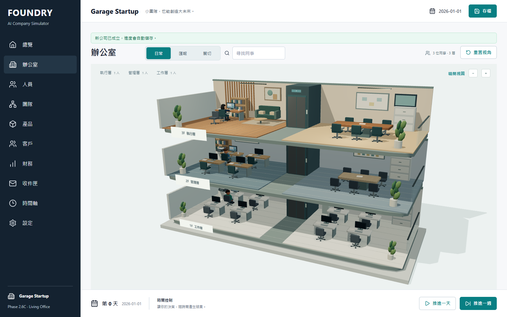
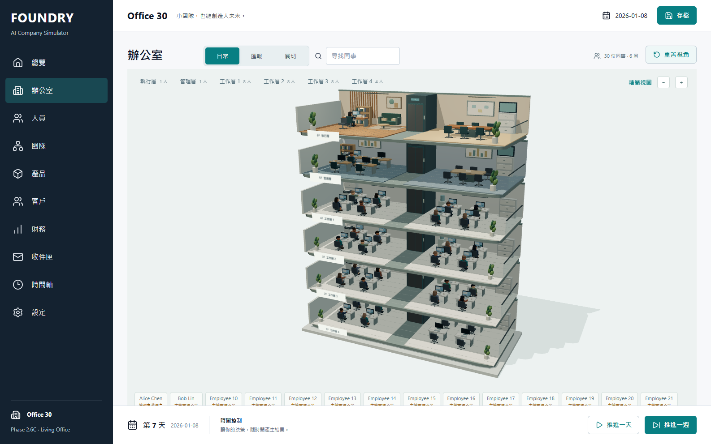
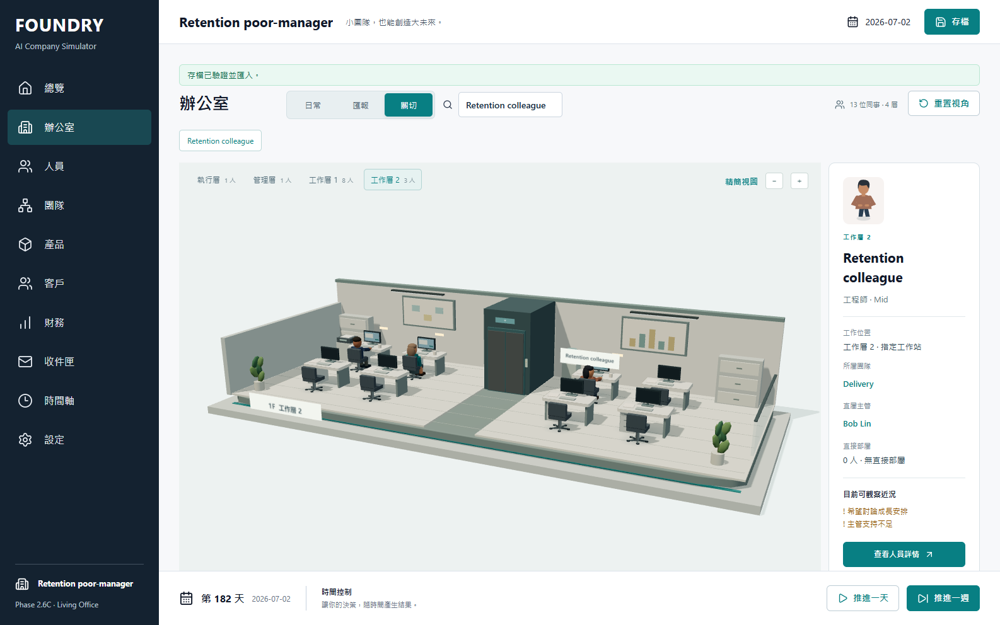
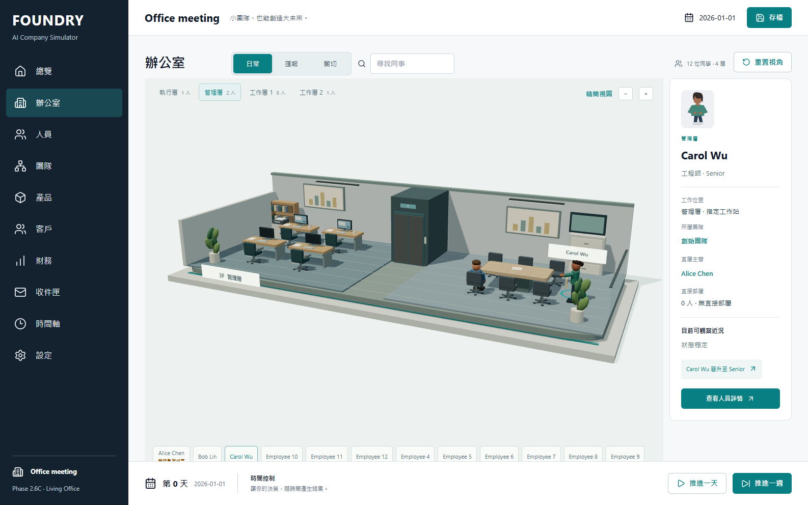
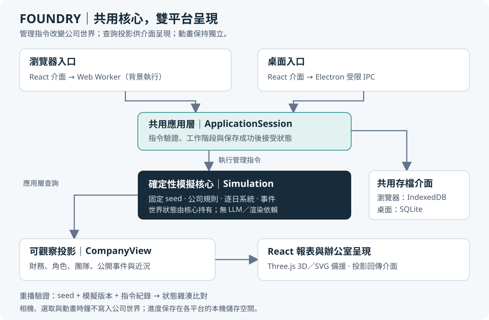

# FOUNDRY｜組織模擬與公司經營遊戲

**從三人新創出發，讓管理決策逐步改變公司的財務、團隊與職涯。**

FOUNDRY 是可在瀏覽器遊玩的公司經營專案，結合確定性模擬、組織管理與互動式 3D 辦公室。玩家扮演 CEO，在有限資金與資訊下決定招募、薪酬、主管安排及產品方向，透過事件與員工近況觀察決策後果。

[立即體驗遊戲](https://foundry-company-simulator.oliverchenovo.chatgpt.site/) · [驗收報告](PHASE2_6C_REPORT.md) · [技術架構](ARCHITECTURE.md) · [完整開發歷程](https://github.com/oliverchenOVO/ai-company-simulator/commits/main/)



*實際網站截圖：執行層、管理層與工作層使用不同空間配置與材質。玩家可以從辦公室選取人物，查看團隊、主管與可觀察近況。本文遊戲圖片均為實際執行畫面。*

## 專案想解決什麼問題？

公司經營不只有營收與人數。加薪能否解決職涯停滯？增加主管會如何影響團隊支持與實際產能？組織擴張後，玩家還能否理解每個人的處境？FOUNDRY 將這些問題轉化為可操作、可保存、可重播的系統，作為管理決策遊戲與組織模擬的實作探索。

目前版本為 **0.2.4／Phase 2.6C**；新遊戲使用 simulation v3，仍支援 v1、v2 舊存檔的原版本重播。組織機制及 3D 辦公室已完成基本驗收，真人遊玩與留任校準仍待進行。

## 可以玩到哪些內容？

| 面向 | 已實作內容 | 玩家如何觀察結果 |
|---|---|---|
| 公司經營 | NT$500,000 開局、三位創辦人、原型產品、招募、薪資與產品策略 | 財務、產品與客戶頁面，按日／週推進 |
| 組織管理 | 團隊配置、匯報關係、主管支持、管理負荷與協作 | 團隊頁面、人物資訊及辦公室匯報線 |
| 員工職涯 | 職級、專家／管理路線、成長期待、晉升與留任因素 | 員工近況、關切事項與事件原因 |
| 生活化呈現 | 樓層聚焦、穩定人物外觀、會議、文件交接與離職空席 | 真實公開事件驅動的有限場景演出 |
| 進度保存 | 自動存檔、手動檢查點、JSON 匯出／匯入與 replay | 刷新續玩，或恢復先前的公司狀態 |

線上版以每個瀏覽器 profile 的本機儲存空間保存進度；不同 profile／裝置的公司互不影響。同一 profile、同一網站的分頁共用儲存空間。清除網站資料會移除存檔，建議先匯出備份；目前尚未提供帳號及跨裝置雲端同步。

## 實際畫面與互動設計

### 讓組織規模成為看得見的空間



*30 人公司：場景由公司的可觀察資料投影而來，樓層與工作站呈現組織配置。完整建築提供總覽，樓層聚焦則保留人物與管理關係的可讀性。*

### 用近況提示支持管理判斷



*選取員工後，可以看到其主管、團隊與「希望討論成長安排」「主管支持不足」等近況。介面不直接揭露精確心理數值，讓玩家根據可觀察資訊做決策。*

### 用事件編排連接模擬與視覺呈現



*會議與文件交接使用公開事件中的實際參與者、主管與座位；人物沿通道移動並返回工作站。動畫呈現既有事件，相機與動畫時鐘不參與公司狀態、存檔或重播結果。*

更多畫面：[正式網站前後比較](docs/living_office_3d_polish/VISUAL_COMPARISON.md) · [事件編排規則](docs/living_office_3d_polish/CHOREOGRAPHY.md)

## 技術架構



*瀏覽器與桌面共用模擬和存檔規則。管理指令由應用層驗證、執行與保存；介面透過查詢取得可觀察資料，再產生報表與辦公室場景。架構圖為 SVG，可獨立嵌入個人網頁。*

| 技術決策 | 實作方式與理由 |
|---|---|
| 可重現的世界 | 固定 seed、受控亂數、版本化模擬、指令紀錄及狀態雜湊，支援 save/load 與 replay 比對 |
| 共用核心 | TypeScript 模擬套件不依賴 React、Electron 或網路；瀏覽器透過 Web Worker，桌面透過受限 IPC 呼叫共用應用層 |
| 可靠存檔 | 瀏覽器使用 IndexedDB，桌面使用 SQLite（sql.js）；候選狀態保存成功後才接受，避免失敗寫入破壞既有進度 |
| 可觀察資訊 | 查詢投影排除精確壓力、忠誠與離職意圖等私有心理狀態；事件說明使用確定性模板 |
| 大型組織 | 稀疏有向關係與每回合組織索引，避免將所有員工兩兩配對；提供多 seed 與大型公司 benchmark |
| 3D 與相容性 | React Three Fiber／Three.js、家具合批、場景延遲載入；手機、WebGL 不可用及超過 100 人時使用 SVG 備援 |

核心 simulation 與目前的事件敘述均不呼叫 LLM，遊戲不需要 API key。已載入的遊戲可以離線操作；公司結果由模擬規則決定。

```text
apps/desktop          React 介面、Web Worker、Electron 與辦公室場景
packages/domain       領域資料結構與驗證
packages/simulation   公司世界、管理指令與逐日系統
packages/application  工作階段、指令協調與查詢
packages/persistence  IndexedDB／SQLite 與存檔驗證
packages/narrative    確定性事件說明
packages/shared       亂數、日期、序列化與雜湊
```

詳細設計：[架構](ARCHITECTURE.md) · [模擬規則](SIMULATION.md) · [存檔格式](SAVE_FORMAT.md) · [3D 呈現層](docs/living_office_3d/ARCHITECTURE.md)

## 如何驗證成果？

以下為 **2026-10-04、0.2.4 功能版本**的驗收紀錄；環境、來源 commit 與限制可在[最終報告](PHASE2_6C_REPORT.md)及 [CI 紀錄](https://github.com/oliverchenOVO/ai-company-simulator/actions/runs/37185671035)追溯。

| 驗證項目 | 結果 | 驗證內容 |
|---|---|---|
| Build／TypeScript／ESLint | 通過 | 正式 Web 與 Electron 建置、嚴格型別及程式規則 |
| 單元測試 | 119／119 | 模擬規則、存檔相容性、replay 與辦公室投影等 |
| CI 瀏覽器／桌面流程 | 28／28、1／1 | 管理操作、保存與跨平台流程 |
| 實際 Windows 打包版 | 3／3 | SQLite、正常關閉及重啟、離線、3D 與 replay |
| 正式 HTTPS 網站 | 27／27 | 進度隔離、刷新、舊版本、辦公室、手機及備援 |
| 軟體 WebGL 繪圖 | 兩種模式各 15／15 | 低階繪圖環境的互動與場景驗收 |
| 多 seed benchmark | 100 seeds × 1,826 天 | 本機 3,217 ms；CI 2,621 ms；六類完整性／重播錯誤均為零 |

Benchmark 時間受硬體與負載影響。這些結果證明的是已測案例中的工程一致性，不等同於真實組織模型的有效性或遊戲趣味性。100 人軟體繪圖仍有明顯延遲；可用樓層聚焦與精簡視圖降低負擔，詳見[效能報告](docs/living_office_3d_polish/PERFORMANCE.md)。

## 開發歷程與可追溯成果

此 repository 保留原專案的完整 commit history 與 GitHub Actions 紀錄，於 2026-10-04 由 private 改為 public。各階段報告保留當時的狀態，早期「尚未實作」或「私人 repository」描述屬於歷史紀錄。

| 階段 | 主要成果 | 文件 |
|---|---|---|
| Phase 1 | 確定性核心、經營介面、雙平台保存與重播 | [基礎驗收](PHASE1_REPORT.md) |
| Phase 1.5／1.5B | 經營平衡稽核、薪酬期望模型與版本相容性 | [平衡稽核](PHASE1_5_REPORT.md)／[薪酬完整性](PHASE1_5B_REPORT.md) |
| Phase 2 | 主管支持、職涯、團隊協作及稀疏關係 | [組織機制](docs/phase2/PHASE2_REPORT.md) |
| Phase 2.5 | 留任診斷、控制情境與真人測試包 | [診斷報告](PHASE2_5_REPORT.md)；真人資料待收集 |
| Phase 2.6／2.6B | 辦公室投影與真正的 3D 呈現 | [辦公室基線](PHASE2_6_REPORT.md)／[3D 驗收](PHASE2_6B_REPORT.md) |
| Phase 2.6C | 材質、人物、鏡頭與真實事件編排 | [最終驗收](PHASE2_6C_REPORT.md) |

## 開發方式與研究延伸

本專案由作者提出產品需求、分階段範圍及驗收方向，使用 AI coding assistant 協作實作、測試與文件整理。作品集以可執行成品、可追溯程式歷史和驗收證據呈現成果；AI 協助開發與遊戲內部的模擬機制是兩個不同層次。

這份實作可作為探索**軟體架構、可重現模擬、人機互動及視覺化**的起點。後續可以研究玩家是否理解事件因果、管理介入是否產生可辨識差異，以及不同組織規模的資訊呈現是否影響決策。

目前尚無獨立真人玩家資料，未宣稱完成留任校準或證明長期遊玩價值。下一步是使用[真人測試包](docs/phase2_5/HUMAN_PLAYTEST.md)收集 3–5 位玩家的匿名回饋，再判斷後續模型與介面調整；帳號同步與下一個大型 Phase 尚未納入目前成果。

## 個人主頁可引用的簡介

> FOUNDRY 是一款結合組織模擬與 3D 辦公室的公司經營遊戲，讓玩家從三人新創開始，透過薪酬、招募、主管與產品決策觀察公司演變。專案採用 TypeScript 共用模擬核心，支援瀏覽器與 Electron 桌面版，以固定 seed、版本化存檔及 replay 驗證結果一致性。開發過程使用 AI coding assistant 協作，保留完整程式歷史與分階段驗收紀錄；目前已完成 0.2.4 工程驗收，真人遊玩與留任校準仍待進行。

## 本機執行

需要 **Node.js 24** 與 **pnpm 11.19.0**。

```bash
pnpm install
pnpm dev
```

開啟 `http://127.0.0.1:5173`。桌面版先執行 `pnpm build`，再執行 `pnpm desktop`。

| 指令 | 用途 |
|---|---|
| `pnpm build` | 型別檢查與 Web／Electron 正式建置 |
| `pnpm typecheck`、`pnpm lint`、`pnpm test` | 型別、靜態檢查與單元測試 |
| `pnpm test:e2e` | 瀏覽器與桌面整合測試 |
| `pnpm benchmark` | 100 seeds、五年模擬與完整性檢查 |
| `pnpm sim --seed garage-001 --years 5` | 無介面模擬及重播檢查 |
| `pnpm package:win` | 建置 Windows portable 成品 |

其他正式網站、打包版及留任稽核指令與環境需求，見 [TESTING.md](TESTING.md)。
